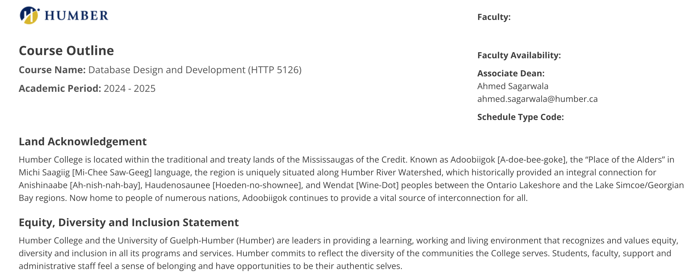

# HTTP 5126



## Learning Outcomes
- Formulate programming statements that create, read, update, or delete data from a data source.
- Design the architecture of a data source for use in a Web application.


This is a link to the class : [http5126](https://humber.ca/transferoptions/course-outlines/outline.html?code=HTTP%205126&view=1&year=2024)

## Code Sample

```
SELECT * FROM customer WHERE country='Mexico';
```

>[!Note]
> Professor Matthew Bebis makes learning enjoyable with their fun approach and is incredibly patient, ensuring every student feels supported!